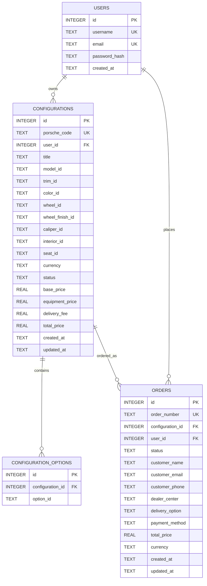
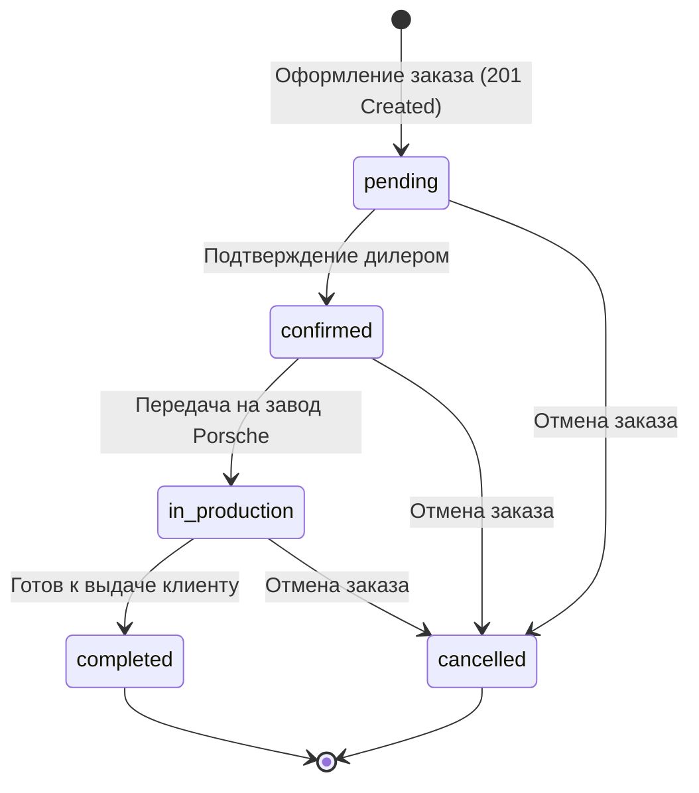

# Porsche Car Configurator (Конфигуратор автомобилей Porsche)

[](https://whoami-28.github.io/auto-config/)
[](https://nodejs.org/)
[](https://www.sqlite.org/)
[](https://www.postman.com/)
[](test/api_test.mjs)
[](LICENSE)

Премиальный полнофункциональный сервис индивидуальной конфигурации автомобилей Porsche в строгом минималистичном стиле: монохромная гамма оттенков черного и глубокого серого, мягкие тени, чистые геометрические формы и отсутствие визуального шума.

Проект разработан в два этапа:
- **I этап (Frontend)**: Клиентский конфигуратор на чистом HTML5, CSS3 и ES6 модулях, динамический пересчет стоимости (MSRP), выбор моделей, цветов, дисков, салона и опций, пошаговая навигация, фотореалистичный визуализатор и движок несовместимостей.
- **II этап (Backend & REST API)**: Полноценный сервер на **Node.js** и **Express.js** с реляционной базой данных **SQLite**, JWT-аутентификацией с разграничением прав доступа, CRUD-операциями для конфигураций и заказов, проверкой бизнес-логики и ограничений на сервере, переходом состояний (State Machine) и набором тестов в **Postman**.

---

## Демо-версия онлайн

**[Открыть конфигуратор на GitHub Pages](https://whoami-28.github.io/auto-config/)**

*Примечание: при развертывании на статических GitHub Pages клиент автоматически использует локальный движок и graceful fallback. При запуске локально активируется полный стек с базой данных SQLite.*

---

## Быстрый старт (Локальный запуск)

### Требования
- **Node.js** версии 18 или новее.
- **npm** версии 8 или новее.

### Установка и запуск

1. Клонируйте репозиторий:
   ```bash
   git clone https://github.com/whoami-28/auto-config.git
   cd auto-config
   ```

2. Установите зависимости:
   ```bash
   npm install
   ```

3. Запустите сервер:
   ```bash
   npm start
   ```
   Сервер запустится по адресу: **http://localhost:3000**  
   Файл базы данных SQLite будет автоматически создан и инициализирован по пути `server/data/configurator.db`. В базу данных уже добавлен предустановленный тестовый пользователь:
   - **Логин**: `demo`
   - **Пароль**: `porsche123`

4. Запустите автоматизированный тестовый набор:
   ```bash
   npm test
   ```
   Результат: **21 PASSED, 0 FAILED (100% Pass Rate)**.

---

## Архитектура базы данных (SQLite)

База данных реализована на высокопроизводительном движке **better-sqlite3** с включенным режимом WAL (Write-Ahead Logging) и принудительным контролем целостности внешних ключей (`PRAGMA foreign_keys = ON;`).



### Таблицы:
1. `users`: Хранение учетных записей водителей с хэшированием паролей через `bcryptjs` (10 раундов соли).
2. `configurations`: Сохранение сборок автомобилей с привязкой к владельцу (`user_id`), уникальным сгенерированным **Porsche Code** (`porsche_code`), статусом (`draft` / `saved` / `ordered`) и рассчитанной ценой.
3. `configuration_options`: Отношение «один-ко-многим» для выбранных дополнительных опций и пакетов с каскадным удалением (`ON DELETE CASCADE`).
4. `orders`: Оформленные клиентские заказы на сборку с уникальным номером заказа (`order_number`), привязкой к конфигурации, дилерскому центру и машине состояний.

---

## REST API Спецификация

Все ответы возвращаются в структурированном формате JSON:
- Успешный ответ: `{ "success": true, "data": ... }`
- Ответ с ошибкой: `{ "success": false, "error": { "code": "...", "message": "..." } }`

### 1. Аутентификация (`/api/auth`)
| Метод | Эндпоинт | Защита | Описание | Коды ответов |
|---|---|---|---|---|
| `POST` | `/api/auth/register` | Публичный | Регистрация нового пользователя | `201 Created`, `400 Bad Request`, `409 Conflict` |
| `POST` | `/api/auth/login` | Публичный | Вход по логину/email и паролю (выдача JWT) | `200 OK`, `400 Bad Request`, `401 Unauthorized` |
| `GET` | `/api/auth/me` | Bearer JWT | Получение данных текущего пользователя | `200 OK`, `401 Unauthorized` |

### 2. Каталог и Мониторинг (`/api`)
| Метод | Эндпоинт | Защита | Описание | Коды ответов |
|---|---|---|---|---|
| `GET` | `/api/health` | Публичный | Проверка статуса сервера и времени непрерывной работы | `200 OK` |
| `GET` | `/api/catalog` | Публичный | Дерево каталога всех 6 моделей, комплектаций, опций и правил | `200 OK` |

### 3. Конфигурации (`/api/configurations`)
| Метод | Эндпоинт | Защита | Описание | Коды ответов |
|---|---|---|---|---|
| `POST` | `/api/configurations/validate` | Публичный | Серверная валидация совместимости и расчет цены без сохранения | `200 OK`, `400 Bad Request` |
| `POST` | `/api/configurations` | Опционально JWT | Создание и сохранение новой конфигурации в БД SQLite | `201 Created`, `400 Bad Request`, `422 Unprocessable` |
| `GET` | `/api/configurations` | Bearer JWT | Список сохраненных конфигураций авторизованного пользователя | `200 OK`, `401 Unauthorized` |
| `GET` | `/api/configurations/:code` | Публичный | Получение конфигурации по уникальному Porsche Code | `200 OK`, `404 Not Found` |
| `PUT` | `/api/configurations/:code` | Bearer JWT | Обновление конфигурации владельцем (с проверкой прав) | `200 OK`, `403 Forbidden`, `404 Not Found`, `422 Unprocessable` |
| `DELETE`| `/api/configurations/:code` | Bearer JWT | Удаление конфигурации владельцем | `200 OK`, `403 Forbidden`, `404 Not Found` |

### 4. Заказы и Жизненный цикл (`/api/orders`)
| Метод | Эндпоинт | Защита | Описание | Коды ответов |
|---|---|---|---|---|
| `POST` | `/api/orders` | Bearer JWT | Оформление заказа (перевод конфигурации в `ordered`) | `201 Created`, `400 Bad Request`, `404 Not Found` |
| `GET` | `/api/orders` | Bearer JWT | Получение истории заказов пользователя | `200 OK`, `401 Unauthorized` |
| `GET` | `/api/orders/:orderNumber` | Bearer JWT | Детальная информация о заказе | `200 OK`, `403 Forbidden`, `404 Not Found` |
| `PATCH`| `/api/orders/:orderNumber/status` | Bearer JWT | Переход состояния заказа по графу жизненного цикла | `200 OK`, `422 Unprocessable`, `404 Not Found` |

---

## Серверная бизнес-логика и переходы состояний

### 1. Серверная проверка правил совместимости (Compatibility Rules)
Серверная валидация (`logicService.js`) строго проверяет правила при попытке создания или обновления конфигурации (`POST /api/configurations`, `PUT /api/configurations/:code`). При наличии конфликта возвращается HTTP `422 Unprocessable Entity` со списком конфликтующих опций:
- **Керамические тормоза PCCB** (`opt_pccb`): требуют диаметр дисков от 20 дюймов (несовместимы с 19-дюймовыми базовыми дисками).
- **Карбоновые ковши Full Bucket** (`seat_bucket_cf`): исключают вентиляцию сидений (`opt_seat_ventilation`).
- **Карбоновая облегченная крыша** (`opt_carbon_roof`): несовместима со сдвижным стеклянным люком (`opt_sunroof`).
- **Премиум-акустика Burmester** (`opt_burmester`): исключает аудиосистему BOSE (`opt_bose`).
- **Колеса Center-Lock с центральной гайкой** (`wheel_20_21_gt3_centerlock`): разрешены исключительно для комплектаций со спортивной ступицей (GTS, Turbo S, GT3 RS).

### 2. Жизненный цикл конфигурации
- `draft` — начальное состояние при выборе в интерфейсе.
- `saved` — конфигурация валидирована и зафиксирована в базе данных с уникальным Porsche Code.
- `ordered` — на основе конфигурации размещен официальный дилерский заказ.

### 3. Машина состояний заказа (Order State Machine)
Переход статусов заказа валидируется строгим графом:

Попытка некорректного перехода (например, перескок из `confirmed` напрямую в `completed` минуя `in_production`) отклоняется сервером со статусом **HTTP 422 Unprocessable Entity**.

---

## Тестирование в Postman

В репозитории подготовлена готовая коллекция Postman со всеми настроенными переменными окружения и встроенными скриптами автоматизированных тестов (`pm.test`).

Файлы:
- `postman/Porsche_Configurator_API.postman_collection.json` — коллекция запросов (формат Postman v2.1.0).
- `postman/README.md` — подробная инструкция по импорту, структуре запросов и запуску.

### Запуск через Postman Collection Runner
1. Импортируйте файл коллекции в **Postman**.
2. Откройте **Run collection** и нажмите **«Run Porsche Car Configurator REST API»**.
3. Все 20 запросов пройдут со 100% успехом, автоматически передавая Bearer-токены, Porsche Code и номера заказов.

### Запуск через утилиту Newman (CLI):
```bash
npx newman run postman/Porsche_Configurator_API.postman_collection.json
```

---

## Модельный ряд и конфигурации

В конфигураторе представлены 6 модельных семейств Porsche с полными техническими характеристиками, комплектациями и фоторендерами:

1. **Porsche 911 (Typ 992)**:
   - Комплектации: Carrera (394 л.с.), Carrera S (450 л.с.), Carrera GTS T-Hybrid (541 л.с.), Turbo S (650 л.с.), GT3 RS (525 л.с.).
2. **Porsche 718 Cayman**:
   - Комплектации: Base, Cayman S, GTS 4.0, GT4 RS (500 л.с. атмосферный оппозитный двигатель).
3. **Porsche Taycan**:
   - Комплектации: Base (408 л.с.), 4S, Turbo, Turbo GT (1034 л.с. Attack Mode).
4. **Porsche Panamera**:
   - Комплектации: Base, Panamera 4 E-Hybrid, GTS, Turbo E-Hybrid (680 л.с.).
5. **Porsche Macan (Добавлен на II этапе)**:
   - Комплектации: Macan (265 л.с.), Macan T (265 л.с., облегченное шасси), Macan S (380 л.с. V6 Twin-Turbo), Macan GTS (440 л.с., спортивная пневмоподвеска).
6. **Porsche Cayenne (Добавлен на II этапе)**:
   - Комплектации: Cayenne (353 л.с.), Cayenne E-Hybrid (470 л.с.), Cayenne S (474 л.с. V8 Twin-Turbo), Cayenne GTS (500 л.с.), Turbo E-Hybrid (739 л.с.).

### Конфигурации салона (Интерьер):
Реализованы реалистичные фоторендеры кокпита для каждой доступной отделки:
- **Two-Tone Bordeaux Red & Black** (`assets/images/porsche_interior_bordeaux.jpg`) — двухцветная гладкая кожа с глубоким бордовым оттенком.
- **Race-Tex Sport Alcantara** (`assets/images/porsche_interior_racetex.jpg`) — гоночная отделка из микрофибры Race-Tex с контрастной строчкой.
- **Club Leather Olea in Truffle Brown** (`assets/images/porsche_interior_truffle.jpg`) — эксклюзивная клубная кожа растительного дубления трюфельного оттенка.
- **Standard Leather Black** (`assets/images/porsche_interior_cockpit.jpg`) — классическая черная кожа Porsche с тиснением герба.

---

## Структура репозитория

```text
CarConfig/
├── server/                               # Серверная часть (Node.js + Express + SQLite)
│   ├── data/
│   │   └── configurator.db               # База данных SQLite (WAL mode)
│   ├── middleware/
│   │   ├── auth.js                       # JWT middleware и защита маршрутов
│   │   └── errorHandler.js               # Централизованный обработчик ошибок
│   ├── routes/
│   │   ├── auth.js                       # Регистрация, авторизация, профиль
│   │   ├── catalog.js                    # Каталог и health-check
│   │   ├── configurations.js             # CRUD конфигураций и валидация
│   │   └── orders.js                     # Оформление заказов и переходы статусов
│   ├── services/
│   │   └── logicService.js               # Бизнес-логика, правила совместимости, расчет цен
│   ├── config.js                         # Конфигурация портов и JWT-секретов
│   ├── db.js                             # Инициализация схемы SQLite и сидинг демо-пользователя
│   └── server.js                         # Главный Express сервер
├── postman/                              # Коллекция для тестирования в Postman
│   ├── Porsche_Configurator_API.postman_collection.json
│   └── README.md                         # Инструкция по тестированию API
├── test/
│   └── api_test.mjs                      # Автоматизированный тестовый скрипт (21 тест)
├── assets/images/                        # Фоторендеры высокого разрешения
│   ├── porsche_macan_front.jpg           # Фоторендер Porsche Macan
│   ├── porsche_cayenne_front.jpg         # Фоторендер Porsche Cayenne
│   ├── porsche_interior_bordeaux.jpg     # Кокпит Bordeaux Red
│   ├── porsche_interior_racetex.jpg      # Кокпит Race-Tex Alcantara
│   ├── porsche_interior_truffle.jpg      # Кокпит Truffle Brown
│   ├── porsche_interior_cockpit.jpg      # Кокпит Black Leather
│   ├── porsche_front_red.jpg
│   ├── porsche_front_blue.jpg
│   ├── porsche_front_chalk.jpg
│   ├── porsche_front_silver.jpg
│   ├── porsche_front_black.jpg
│   ├── porsche_front_yellow.jpg
│   ├── porsche_side_profile.jpg
│   ├── porsche_rear_view.jpg
│   ├── porsche_night_lights.jpg
│   ├── porsche_taycan_front.jpg
│   ├── porsche_panamera_front.jpg
│   └── porsche_cayman_front.jpg
├── css/
│   └── style.css                         # Минималистичная монохромная дизайн-система
├── js/
│   ├── app.js                            # UI-контроллер, клиентская аутентификация и навигация
│   ├── data.js                           # Каталог моделей, опций и матрица цен
│   ├── engine.js                         # Расчетный движок, зависимости и экспорт/импорт
│   └── visualizer.js                     # Фотореалистичный визуализатор ракурсов и интерьеров
├── index.html                            # Главная страница SPA
├── package.json                          # Скрипты и зависимости
└── README.md                             # Документация проекта
```

---

## Лицензия

Распространяется под лицензией MIT. Проект создан в образовательных целях в качестве демонстрации архитектуры современных веб-приложений.
